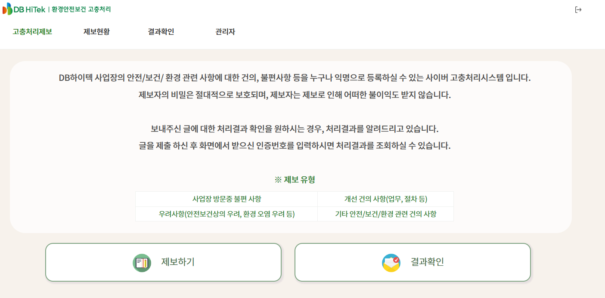

# 🧾 환경안전보건고충처리 시스템 (ESHS Report System)

내부 직원 및 외부 협력사/주민을 대상으로 한 고충 접수 시스템입니다.

## 🔹 주요 기능
- 익명 제보 가능
- 제보 접수 및 이력 관리
- 안전관리팀의 처리 절차 기록

## 🧩 기술 스택
Java, Spring, JavaScript, jQuery, HTML, CSS, MyBatis, Oracle DB, Git

## 🖼️ 시스템 화면

