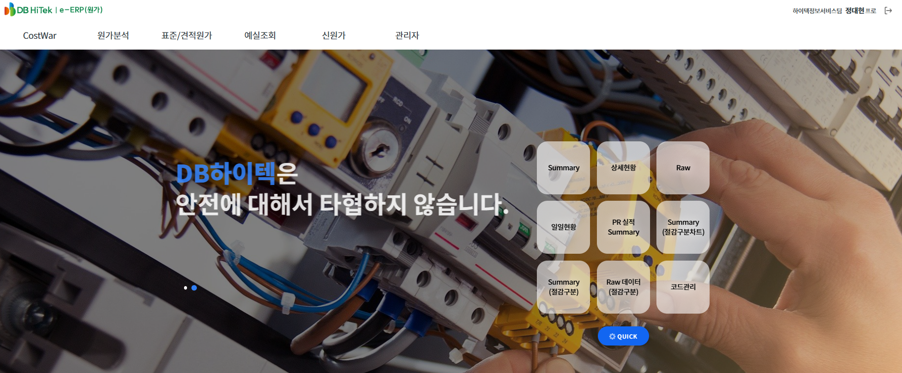

# 📊 원가 시스템 (Procurement System)

DB하이텍의 자재 및 생산 관련 비용을 계산하고 계획을 수립하는 시스템입니다.

※ 해당 시스템은 사내 시스템으로 외부에서 접속이 불가능합니다.

## 🔹 주요 기능
- 연간/월간/일간 계획 수립 (사업계획/실행계획/실적계획)
- 자재 가격 산정 (가동률, 환율 등 변수 설정)
- 가격 데이터 기반 영업 전략 수립 지원

## 🧩 기술 스택
Java, Spring, JavaScript, jQuery, HTML, CSS, MyBatis, Oracle DB, Git

## 🖼️ 시스템 화면

