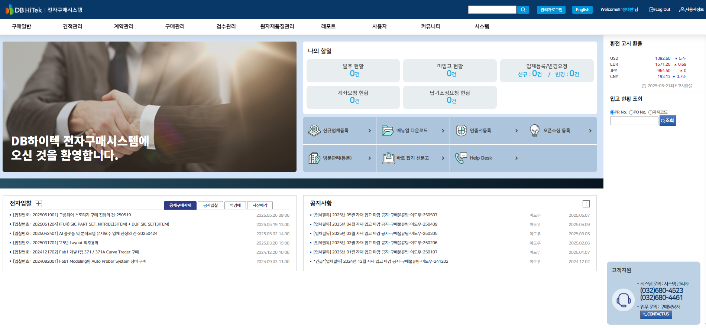

# 🛒 구매 시스템 (Procurement System)
[👉 시스템 바로가기](https://hpis.dbhitek.com/)

DB하이텍과 협력 업체 간의 전체 구매 프로세스를 지원하는 시스템입니다.

## 🔹 주요 기능
- 계약/입찰/제안/소싱 등 전체 구매 절차 관리
- 발주서 및 거래명세서 출력
- 바코드 생성 및 검수 프로세스
- 업체 평가 및 품질검증
- 사외 협력업체 대상 문의 응대 기능

## 💼 역할
- 유지보수 및 신규 기능 개발
- 품질관리 모듈 신규 구축 (PL)
- 외부 사용자를 위한 안정성 확보 및 UI 개선

## 🖼️ 시스템 화면

