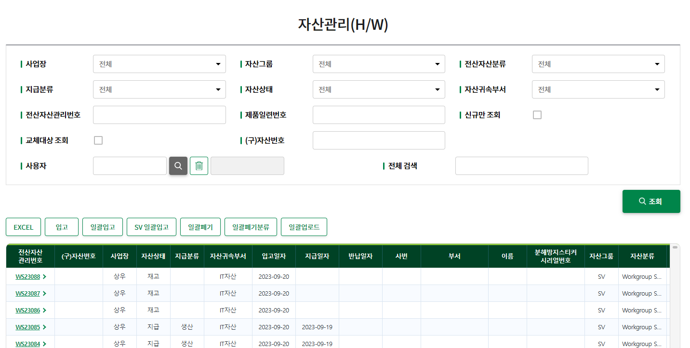

# 💻 IT 자산관리 시스템 (IT Asset Management System)

DB하이텍 사내 IT 장비 및 소프트웨어 자산을 통합적으로 관리하는 시스템입니다.

※ 해당 시스템은 사내 시스템으로 외부에서 접속이 불가능합니다.

## 🔹 주요 기능
- 자산 등록/대여/반납/반입/교체/폐기 등 상태별 관리
- 모니터, 노트북, 서버 등 하드웨어 자산 추적
- 라이선스 관리 등 소프트웨어 자산 통합 관리

## 🧩 기술 스택
Java, Spring, JavaScript, jQuery, HTML, CSS, MyBatis, Oracle DB, Git

## 🖼️ 시스템 화면

